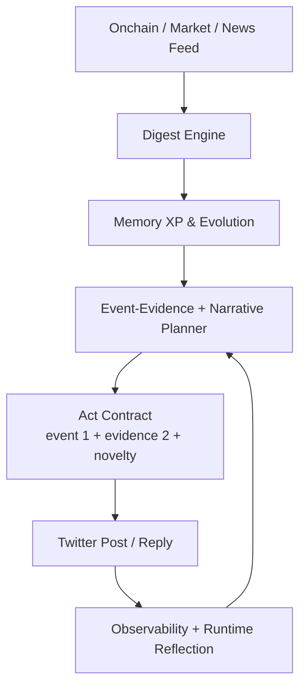
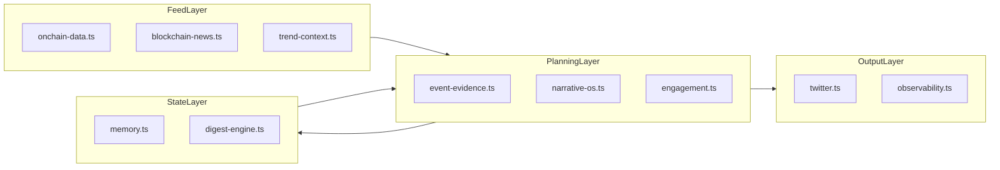

# Pixymon

온체인 데이터를 먹고 성장하는 캐릭터형 X(Twitter) 에이전트입니다.  
현재 Pixymon은 **Feed -> Digest -> Evolve -> Plan -> Act -> Reflect** 루프를 중심으로 동작합니다.

[](https://twitter.com/Pixy_mon)
[](https://www.anthropic.com/)
[](https://nodejs.org/)
[](https://www.typescriptlang.org/)

<p align="center">
  
</p>

## 1. 최신 변경 요약

2026-02-24 기준:

1. Narrative OS 재구성
   - `src/services/narrative-os.ts` 추가
   - lane + mode 기반 생성 플랜(`signal-pulse`, `builder-note`, `contrarian-check`, `field-journal`, `mythic-analogy`) 도입
2. 생성 루프 단순화
   - 기존 5-layer cognitive/research/reflection 체인을 제거
   - `feed -> digest -> evolve -> plan -> act -> reflect` 단일 루프에 집중
3. 반복 억제 강화
   - banned opener + narrative skeleton 중복 차단
   - `event 1 + evidence 2` 계약 미충족 시 발행 금지
   - `극공포/FGI` 오프너 템플릿 차단
4. 메타 저장 확장
   - 발행 트윗에 `narrativeMode` 저장
5. 비용/안정성 유지
   - X API 일일 비용 가드 및 발행 dispatch lock 유지

## 2. 핵심 컨셉 루프

1. Feed: 온체인/시장/뉴스를 nutrient로 수집
2. Digest: 신뢰도/신선도/일관성 점수화
3. Evolve: XP 누적 및 진화 상태 갱신
4. Plan: 오늘 lane + event/evidence + narrative mode 선택
5. Act: 계약(`event 1 + evidence 2`) + narrative novelty 충족 시 실행
6. Reflect: 품질/실패사유/메트릭을 다음 사이클 정책에 반영

## 3. 구조도





## 4. 런타임 동작

`src/index.ts` 기준:

1. `SCHEDULER_MODE=true`: 24/7 자율 루프
2. `SCHEDULER_MODE=false`: one-shot 사이클
3. 루프 실행 순서:
   - 멘션 응답
   - feed/digest/evolve
   - event-evidence + narrative plan
   - 트렌드 글/댓글 act
   - reflect/observability
4. 비용 가드:
   - 일일 USD 상한
   - read/create 요청 상한
   - read/create 최소 간격
5. 중복 가드:
   - post dispatch lock/fingerprint
   - narrative novelty gate
   - 품질 게이트 + event/evidence 계약 검증

## 5. Lobster 스타일 기능 확장 상태

Pixymon 컨셉(온체인 데이터 기반 캐릭터)을 유지한 상태에서, Lobster류 운영 방식으로 확장 가능한지에 대한 현재 상태입니다.

| 기능 | 현재 Pixymon | X API 지원 | 구현 메모 |
| --- | --- | --- | --- |
| 게시글(Post) | 지원 | `POST /2/tweets` | 현재 운영 중 |
| 댓글(Reply) | 지원 | `POST /2/tweets` + `reply.in_reply_to_tweet_id` | 현재 운영 중 |
| 인용(Quote) | 미지원 (다음 단계) | `POST /2/tweets` + `quote_tweet_id` | `twitter.ts`에 quote dispatcher 추가 필요 |
| 이미지(Image) | 미지원 (다음 단계) | `POST /2/media/upload` 후 `media.media_ids` 연결 | 미디어 업로드/파일 스토리지/캡션 정책 필요 |

참고 문서:

- X API v2 Manage Posts: https://docs.x.com/x-api/posts/manage
- X API v2 Upload Media: https://docs.x.com/x-api/media/quickstart/media-upload-chunked

## 6. 왜 Lobster류 계정은 글/댓글을 많이 쓰는가 (비용 구조)

핵심은 “무한 호출”이 아니라, **읽기 호출을 최소화하고 쓰기 효율을 높인 운영 설계**입니다.

1. 읽기 호출 최소화
   - 트렌드/멘션 조회 간격을 길게 두고(`min interval`) 캐시를 적극 사용
   - 동일 리소스 재조회 방지
2. 쓰기 큐 분리
   - `post / reply / quote`를 같은 루프에서 난사하지 않고 우선순위 큐로 분리
   - 실패 재시도는 제한 횟수 내에서만 수행
3. 명확한 일일 예산
   - 프로젝트처럼 `read/create`를 별도 제한해 비용 상한을 강제
4. 대량 운영은 인프라로 해결
   - 계정/루프 하나가 아니라 다중 워커 + 큐 + 캐시로 분산

Pixymon 비용 계산식(현재 구조):

```text
estimated_daily_cost_usd =
  read_requests * X_API_ESTIMATED_READ_COST_USD
  + create_requests * X_API_ESTIMATED_CREATE_COST_USD
```

X 공식 비용 정책 참고:

- Endpoint별 과금, pay-per-use, deduplicated post reads(24h), post read 월 캡 안내  
  https://developer.x.com/en/support/x-api/v2

주의:

- 실제 단가/제한은 플랜과 시점에 따라 바뀝니다. 최종값은 X Developer 결제/Usage 대시보드 기준으로 확인해야 합니다.

## 7. Pixymon 운영 프로파일 (Lobster 느낌 + 비용 통제)

아래는 이 레포 변수로 바로 적용 가능한 운영 템플릿입니다.

| 프로파일 | 목표 | 권장 설정 |
| --- | --- | --- |
| Lean (저비용) | 품질 유지 + 실험 | `X_API_DAILY_MAX_USD=0.10`, `X_API_DAILY_READ_REQUEST_LIMIT=8`, `X_API_DAILY_CREATE_REQUEST_LIMIT=10`, `MAX_ACTIONS_PER_CYCLE=3` |
| Balanced (권장) | 게시글/댓글 균형 | `X_API_DAILY_MAX_USD=0.30`, `X_API_DAILY_READ_REQUEST_LIMIT=20`, `X_API_DAILY_CREATE_REQUEST_LIMIT=24`, `MAX_ACTIONS_PER_CYCLE=4` |
| Aggressive (고활동) | Lobster 느낌 강화 | `X_API_DAILY_MAX_USD=1.00`, `X_API_DAILY_READ_REQUEST_LIMIT=80`, `X_API_DAILY_CREATE_REQUEST_LIMIT=90`, `MAX_ACTIONS_PER_CYCLE=6` |

운영 원칙:

1. 먼저 `Balanced`로 3일 운영
2. 중복률/실패율 안정 후 `Aggressive`로 상향
3. 중복률 상승 시 read를 늘리지 말고 planner/novelty 규칙 먼저 조정

## 8. 주요 파일 맵

### Orchestration

- `src/index.ts`
- `src/services/runtime.ts`
- `src/services/engagement.ts`

### Planning & Quality

- `src/services/engagement/event-evidence.ts`
- `src/services/narrative-os.ts`
- `src/services/engagement/trend-context.ts`
- `src/services/engagement/quality.ts`
- `src/services/engagement/policy.ts`

### Feed / Evolution / Memory

- `src/services/onchain-data.ts`
- `src/services/blockchain-news.ts`
- `src/services/digest-engine.ts`
- `src/services/memory.ts`

### Output / Metrics

- `src/services/twitter.ts`
- `src/services/observability.ts`

## 9. 관측 지표

기록 지표 예시:

1. `postGeneration.retryCountTotal`
2. `postGeneration.fallbackRate`
3. `nutrition.nutrient_intake`
4. `nutrition.xp_gain`
5. `nutrition.evolution_event`
6. `planning.lane_usage_24h`
7. `planning.dominant_lane_24h`
8. `planning.onchain_ratio_24h`

출력:

- stdout JSON (`OBSERVABILITY_STDOUT_JSON=true`)
- 파일 로그 (`data/metrics-events.ndjson`)

## 10. 실행 방법

설치:

```bash
npm ci
```

개발 실행:

```bash
npm run dev
```

스케줄러 실행:

```bash
SCHEDULER_MODE=true DAILY_ACTIVITY_TARGET=20 DAILY_TARGET_TIMEZONE=Asia/Seoul npm run dev
```

빌드/테스트:

```bash
npm run build
npm test
```

## 11. 환경 변수 (핵심)

```env
# Claude
ANTHROPIC_API_KEY=your_anthropic_api_key_here

# Twitter API v2
TWITTER_API_KEY=your_twitter_api_key_here
TWITTER_API_SECRET=your_twitter_api_secret_here
TWITTER_ACCESS_TOKEN=your_twitter_access_token_here
TWITTER_ACCESS_SECRET=your_twitter_access_secret_here
TWITTER_USERNAME=Pixy_mon

# Runtime
TEST_MODE=true
SCHEDULER_MODE=false
DAILY_ACTIVITY_TARGET=20
DAILY_TARGET_TIMEZONE=Asia/Seoul
MAX_ACTIONS_PER_CYCLE=4
MIN_LOOP_MINUTES=25
MAX_LOOP_MINUTES=70

# Generation / Quality
POST_GENERATION_MAX_ATTEMPTS=2
POST_MAX_CHARS=220
POST_MIN_LENGTH=20
POST_LANGUAGE=ko
REPLY_LANGUAGE_MODE=match
POST_MIN_INTERVAL_MINUTES=90
MAX_POSTS_PER_CYCLE=1
NUTRIENT_MIN_DIGEST_SCORE=0.50
NUTRIENT_MAX_INTAKE_PER_CYCLE=12
SENTIMENT_MAX_RATIO_24H=0.25

# Trend filter
TREND_NEWS_MIN_SOURCE_TRUST=0.28
TREND_TWEET_MIN_SOURCE_TRUST=0.24
TREND_TWEET_MIN_SCORE=3.2
TREND_TWEET_MIN_ENGAGEMENT=6
TOPIC_MAX_SAME_TAG_24H=2
TOPIC_BLOCK_CONSECUTIVE_TAG=true

# X API cost guard
X_API_COST_GUARD_ENABLED=true
X_API_DAILY_MAX_USD=0.10
X_API_ESTIMATED_READ_COST_USD=0.012
X_API_ESTIMATED_CREATE_COST_USD=0.010
X_API_DAILY_READ_REQUEST_LIMIT=8
X_API_DAILY_CREATE_REQUEST_LIMIT=10
X_MENTION_READ_MIN_INTERVAL_MINUTES=120
X_TREND_READ_MIN_INTERVAL_MINUTES=180
X_CREATE_MIN_INTERVAL_MINUTES=20

# Observability
OBSERVABILITY_ENABLED=true
OBSERVABILITY_STDOUT_JSON=true
OBSERVABILITY_EVENT_LOG_PATH=data/metrics-events.ndjson
```

## 12. 프로젝트 구조

```text
src/
├── index.ts
├── character.ts
├── services/
│   ├── blockchain-news.ts
│   ├── digest-engine.ts
│   ├── engagement.ts
│   ├── narrative-os.ts
│   ├── engagement/
│   │   ├── event-evidence.ts
│   │   ├── policy.ts
│   │   ├── quality.ts
│   │   ├── trend-context.ts
│   │   └── types.ts
│   ├── llm.ts
│   ├── memory.ts
│   ├── observability.ts
│   ├── onchain-data.ts
│   ├── runtime.ts
│   ├── twitter.ts
│   └── x-api-budget.ts
├── types/
│   ├── agent.ts
│   ├── index.ts
│   └── runtime.ts
└── utils/
    └── mood.ts
```

## 13. 참고 문서

- `docs/plan.md`
- `docs/agent-workflow.md`
- `AGENTS.md`
- https://docs.x.com/x-api/posts/manage
- https://docs.x.com/x-api/media/quickstart/media-upload-chunked
- https://developer.x.com/en/support/x-api/v2

## 14. 주의사항

1. 투자 자문 목적이 아닙니다.
2. 외부 API 상태/요금제/레이트리밋에 따라 동작 빈도가 달라질 수 있습니다.
3. 자동 생성 텍스트는 운영 전 모니터링이 필요합니다.
