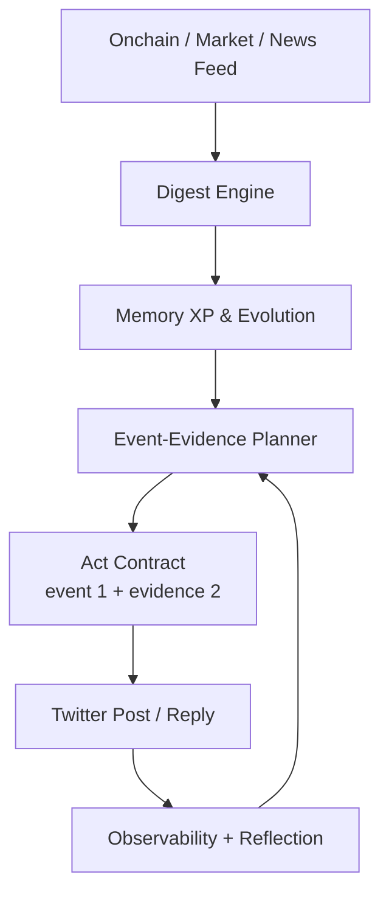
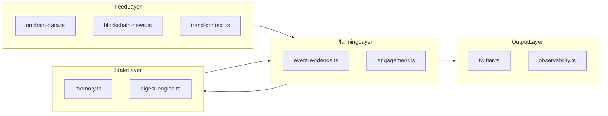

# Pixymon

온체인 데이터를 먹고 성장하는 캐릭터형 X(Twitter) 에이전트입니다.  
현재 Pixymon은 **Feed -> Digest -> Evolve -> Plan -> Act -> Reflect** 루프를 중심으로 동작합니다.

[](https://twitter.com/Pixy_mon)
[](https://www.anthropic.com/)
[](https://nodejs.org/)
[](https://www.typescriptlang.org/)

<p align="center">
  
</p>

## 1. 최신 변경 요약

2026-02-20 기준:

1. `Feed`를 이벤트/근거 중심으로 강화
   - `TrendEvent` + `OnchainEvidence` 모델 추가
2. `Plan` 단계 추가
   - lane 강제 선택: `protocol`, `ecosystem`, `regulation`, `macro`, `onchain`, `market-structure`
   - 24h lane 편중 제한 (`onchain` 최대 30%)
3. `Act` 계약 강제
   - 트윗 생성 규칙: **event 1개 + evidence 2개**
   - 미충족 시 생성 거절 + 재시도
4. 메타 저장 확장
   - 발행 트윗에 lane/event/evidence 메타 저장
5. 관측성 확장
   - `planning.lane_usage_24h`, `planning.dominant_lane_24h`, `planning.onchain_ratio_24h` 추가
6. 구조 최적화
   - 이벤트/근거 플래너를 `src/services/engagement/event-evidence.ts`로 분리

## 2. 핵심 컨셉 루프

1. Feed: 온체인/시장/뉴스를 nutrient로 수집
2. Digest: 신뢰도/신선도/일관성 점수화
3. Evolve: XP 누적 및 진화 상태 갱신
4. Plan: 오늘 lane + event/evidence 액션 플랜 선택
5. Act: 계약(`event 1 + evidence 2`) 충족 글/댓글 실행
6. Reflect: 품질/실패사유/메트릭을 다음 사이클 정책에 반영

## 3. 구조도





## 4. 런타임 동작

`src/index.ts` 기준:

1. `SCHEDULER_MODE=true`: 24/7 자율 루프
2. `SCHEDULER_MODE=false`: one-shot 사이클
3. 루프 실행 순서:
   - 멘션 응답
   - feed/digest/evolve
   - event-evidence plan
   - 트렌드 글/댓글 act
   - reflect/observability
4. 비용 가드:
   - 일일 USD 상한
   - read/create 요청 상한
   - read/create 최소 간격
5. 중복 가드:
   - post dispatch lock/fingerprint
   - signal fingerprint cooldown
   - 품질 게이트 + 계약 검증

## 5. 주요 파일 맵

### Orchestration

- `src/index.ts`
- `src/services/runtime.ts`
- `src/services/engagement.ts`

### Planning & Quality

- `src/services/engagement/event-evidence.ts`
- `src/services/engagement/trend-context.ts`
- `src/services/engagement/quality.ts`
- `src/services/engagement/policy.ts`

### Feed / Evolution / Memory

- `src/services/onchain-data.ts`
- `src/services/blockchain-news.ts`
- `src/services/digest-engine.ts`
- `src/services/memory.ts`

### Output / Metrics

- `src/services/twitter.ts`
- `src/services/observability.ts`

## 6. 관측 지표

기록 지표 예시:

1. `postGeneration.retryCountTotal`
2. `postGeneration.fallbackRate`
3. `nutrition.nutrient_intake`
4. `nutrition.xp_gain`
5. `nutrition.evolution_event`
6. `planning.lane_usage_24h`
7. `planning.dominant_lane_24h`
8. `planning.onchain_ratio_24h`

출력:

- stdout JSON (`OBSERVABILITY_STDOUT_JSON=true`)
- 파일 로그 (`data/metrics-events.ndjson`)

## 7. 실행 방법

설치:

```bash
npm ci
```

개발 실행:

```bash
npm run dev
```

스케줄러 실행:

```bash
SCHEDULER_MODE=true DAILY_ACTIVITY_TARGET=20 DAILY_TARGET_TIMEZONE=Asia/Seoul npm run dev
```

빌드/테스트:

```bash
npm run build
npm test
```

## 8. 환경 변수 (핵심)

```env
# Claude
ANTHROPIC_API_KEY=your_anthropic_api_key_here

# Twitter API v2
TWITTER_API_KEY=your_twitter_api_key_here
TWITTER_API_SECRET=your_twitter_api_secret_here
TWITTER_ACCESS_TOKEN=your_twitter_access_token_here
TWITTER_ACCESS_SECRET=your_twitter_access_secret_here
TWITTER_USERNAME=Pixy_mon

# Runtime
TEST_MODE=true
SCHEDULER_MODE=false
DAILY_ACTIVITY_TARGET=20
DAILY_TARGET_TIMEZONE=Asia/Seoul
MAX_ACTIONS_PER_CYCLE=4
MIN_LOOP_MINUTES=25
MAX_LOOP_MINUTES=70

# Generation / Quality
POST_GENERATION_MAX_ATTEMPTS=2
POST_MAX_CHARS=220
POST_MIN_LENGTH=20
POST_LANGUAGE=ko
REPLY_LANGUAGE_MODE=match
POST_MIN_INTERVAL_MINUTES=90
SIGNAL_FINGERPRINT_COOLDOWN_HOURS=8
MAX_POSTS_PER_CYCLE=1
NUTRIENT_MIN_DIGEST_SCORE=0.50
NUTRIENT_MAX_INTAKE_PER_CYCLE=12

# Fear & Sentiment
FG_EVENT_MIN_DELTA=10
FG_REQUIRE_REGIME_CHANGE=true
REQUIRE_FG_EVENT_FOR_SENTIMENT=true
SENTIMENT_MAX_RATIO_24H=0.25

# Trend filter
TREND_NEWS_MIN_SOURCE_TRUST=0.28
TREND_TWEET_MIN_SOURCE_TRUST=0.24
TREND_TWEET_MIN_SCORE=3.2
TREND_TWEET_MIN_ENGAGEMENT=6
TOPIC_MAX_SAME_TAG_24H=2
TOPIC_BLOCK_CONSECUTIVE_TAG=true

# X API cost guard
X_API_COST_GUARD_ENABLED=true
X_API_DAILY_MAX_USD=0.10
X_API_ESTIMATED_READ_COST_USD=0.012
X_API_ESTIMATED_CREATE_COST_USD=0.010
X_API_DAILY_READ_REQUEST_LIMIT=8
X_API_DAILY_CREATE_REQUEST_LIMIT=10
X_MENTION_READ_MIN_INTERVAL_MINUTES=120
X_TREND_READ_MIN_INTERVAL_MINUTES=180
X_CREATE_MIN_INTERVAL_MINUTES=20

# Observability
OBSERVABILITY_ENABLED=true
OBSERVABILITY_STDOUT_JSON=true
OBSERVABILITY_EVENT_LOG_PATH=data/metrics-events.ndjson
```

## 9. 프로젝트 구조

```text
src/
├── index.ts
├── character.ts
├── services/
│   ├── blockchain-news.ts
│   ├── cognitive-engine.ts
│   ├── digest-engine.ts
│   ├── engagement.ts
│   ├── engagement/
│   │   ├── event-evidence.ts
│   │   ├── fear-greed-policy.ts
│   │   ├── policy.ts
│   │   ├── quality.ts
│   │   ├── signal-fingerprint.ts
│   │   ├── trend-context.ts
│   │   └── types.ts
│   ├── llm.ts
│   ├── memory.ts
│   ├── observability.ts
│   ├── onchain-data.ts
│   ├── reflection.ts
│   ├── research-engine.ts
│   ├── runtime.ts
│   ├── twitter.ts
│   └── x-api-budget.ts
├── types/
│   ├── agent.ts
│   ├── index.ts
│   └── runtime.ts
└── utils/
    └── mood.ts
```

## 10. 참고 문서

- `docs/plan.md`
- `docs/agent-workflow.md`
- `AGENTS.md`

## 11. 주의사항

1. 투자 자문 목적이 아닙니다.
2. 외부 API 상태/요금제/레이트리밋에 따라 동작 빈도가 달라질 수 있습니다.
3. 자동 생성 텍스트는 운영 전 모니터링이 필요합니다.
